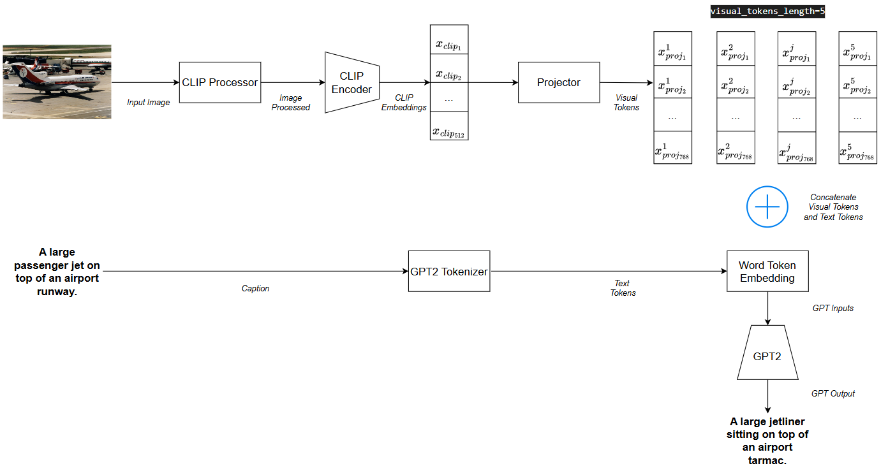

# Image Captioning Using CLIP and GPT-2

This project implements a deep learning pipeline for **image captioning**, combining **CLIP** as a vision encoder and **GPT-2** as a language model. The model projects CLIP visual features into GPT-2's input space to generate natural language descriptions for images. The model is fine-tuned on the Microsoft **COCO** dataset, which contains over 82,000 training images and 40,000 validation images.\
The best-performing model achieves high **BERTScore** metrics:

<div align="center">

| Metric | Value |
| --------- | ------ |
| Precision | 0.912 |
| Recall | 0.902 |
| F1-Score | 0.906 |

</div>

## Output Examples on Real Images

<div align="center">
  <table>
    <tr>
      <td align="center">
        
        <br><em>Caption: A car is parked in front of a car dealer.</em>
      </td>
      <td align="center">
        
        <br><em>Caption: A view of a city street at night.</em>
      </td>
    </tr>
    <tr>
      <td align="center">
        
        <br><em>Caption: A man holding a stuffed animal in his hand.</em>
      </td>
      <td align="center">
        
        <br><em>Caption: A cat that is laying down on a bed.</em>
      </td>
    </tr>
  </table>
</div>

## Model Architecture

The model architecture is a hybrid design that combines **CLIP** (as a visual encoder) and **GPT-2** (as a language decoder). The main idea is to project the visual embeddings extracted from an image into the input embedding space of GPT-2, allowing the language model to generate captions conditioned on visual content.

<div style="text-align: center;">
    
</div>


- **CLIP Encoder**

  The input image is processed using CLIP to extract high-level semantic features via `CLIPProcessor`. The processed image is then encoded using `CLIPModel` into a 512-dimensional vector.

- **Projection Module**

  A simple MLP (a linear layer followed by a `Tanh` activation) is used to project the CLIP embedding into a sequence of GPT-2-compatible embeddings. These are treated as *visual tokens*. In the example above, 5 *visual tokens* are generated, each of dimensionality 768.

- **GPT-2 Decoder**

  The visual tokens are concatenated with text tokens (caption inputs) at the embedding level. The combined sequence is passed through GPT-2 to predict the caption. During training, the loss is computed only on the text tokens, ignoring the visual prefix.

## Training Pipeline
The training process is fully configurable through a JSON configuration file ([training_config.json](config/training_config.json)). This allows for maximum flexibility — models, paths, and hyperparameters can be changed without modifying the core codebase.

### Configuration Parameters

| **Key** | **Description** | **Recommended Value** |
|--------|------------------|------------------------------|
| `clip_config.model` | Name of the pretrained CLIP model | `"openai/clip-vit-base-patch32"` |
| `clip_config.image_size` | Resize dimensions for input images `[H, W]` (optional; default is [224, 224]) | `[224, 224]` |
| `gpt2_config.model` | Name of the pretrained GPT-2 model | `"gpt2"` |
| `gpt2_config.visual_tokens_length` | Number of visual prefix tokens passed to GPT-2 | `5` |
| `gpt2_config.text_tokens_max_length` | Maximum number of tokens for the caption text | `10` |
| `gpt2_config.n_layers_to_freeze` | Number of GPT-2 attention layers to freeze (optional; default is None — means all layers are trainable) | `10` |
| `data_paths.train_captions_path` | Path to training captions JSON file | filename generated with the script [coco_captions.py](src/utils/coco_captions.py) when `split = train`|
| `data_paths.val_captions_path` | Path to validation captions JSON file | filename generated with the script [coco_captions.py](src/utils/coco_captions.py) when `split = val` |
| `training_config.subset_ratio` | Ratio of COCO dataset to use for each epoch (optional; default is 1.0 — means all dataset is used) | `0.4` |
| `training_config.batch_size` | Batch size for training and validation | `64` |
| `training_config.num_epochs` | Number of training epochs | `10` |
| `training_config.learning_rate` | Learning rate for the optimizer | `1e-4` |
| `training_config.enable_GPU` | Whether to use GPU if available (optional; default is False) | `true` |
| `training_config.trained_model_path` | File path to save the best performing model | — |
| `training_config.monitoring_plots_path` | File path to save training curves image | — |

---

### Pipeline Steps

1. **Load Configuration**
   Load the training configuration from a `.json` file using `pydantic` validation.

2. **Initialize Pretrained Models**
   Load CLIP and GPT-2 models from **Hugging Face** using their specified names.

3. **Prepare Dataset and Dataloaders**
   - Tokenize captions with GPT-2 tokenizer.
   - Preprocess images using `CLIPProcessor`.
   - Generate image embeddings using `CLIPModel`.
   - Generate batches using PyTorch `DataLoader`.

4. **Build the Caption Model**
   - Instantiate the `ClipCaptionModel` which includes a projection layer to map CLIP embeddings to GPT-2 token space.
   - Instantiate the optimizer and all the losses and metrics tracking lists.

5. **Train the Model**
   For each epoch:
   - Compute loss between generated and true tokens.
   - Backpropagate gradients.
   - Perform optimization steps.

6. **Validate on Validation Data**
   - Evaluate model performance on the validation set.
   - Compute validation loss and BERTScore (Precision, Recall, F1).

7. **Save Best Model**
   Save the model when it achieves the lowest validation loss (with a timestamped filename prefix). The model is saved as a `.pkl` file with the following content:
   - `caption_model_state_dict`: The state dictionary of the caption model.
   - `clip_config`: The configuration for CLIP model.
   - `gpt2_config`: The configuration for GPT-2 model.
   - `training_config`: The configuration for the training process.
   - `train_loss`: The mean training loss for that epoch.
   - `validation_loss`: The mean validation loss for that epoch (i.e., the lowest validation loss achieved so far).
   - `validation_bert_precision`: The precision of the model using BERTScore.
   - `validation_bert_recall`: The recall of the model using BERTScore.
   - `validation_bert_f1_score`: The F1-score of the model using BERTScore.

8. **Log and Visualize Metrics**
   - Save plots of training/validation loss and BERT metrics per epoch. Examples can be found in the [`figs`](figs) folder.
   - Logs are written to both console and file.

## Inference Pipeline
The inference process is fully automated and configurable using a simple JSON file ([inference_config.json](config/inference_config.json)). The pipeline loads all `.pkl` models from the specified directory, generates image captions using each model, and stores the results in a CSV file.

### Configuration Parameters

| **Key**              | **Description**                                                                 |
|----------------------|---------------------------------------------------------------------------------|
| `enable_GPU`         | Whether to use GPU if available                            |
| `images_dir`         | Path to the folder containing images for inference (`.jpg`, `.jpeg`, `.png` supported)                            |
| `trained_models_dir` | Path to the directory containing the trained `.pkl` model files                 |
| `output_filename`    | Filename of the CSV file where inference results will be saved        |

---

### Pipeline Steps

1. **Load Configuration**

   Read configuration parameters from [inference_config.json](config/inference_config.json).

2. **Load Trained Models**
   - Iterate through all `.pkl` files inside the `trained_models_dir`.
   - Each `.pkl` contains:
     - CLIP and GPT-2 model names
     - Model weights
     - Hyperparameters used during training
     - Tokenizer configurations
   - All models are loaded at the beginning of the pipeline and stored in the dictionary `loaded_models`.

3. **Generate Captions**

   For each image and each model:
   - Resize the image to the CLIP model's expected input size.
   - Compute CLIP image embeddings.
   - Pass embeddings through the `ClipCaptionModel` to generate captions.
   - Store captions in the list `results`.

4. **Export Results**

   Save all image captions into a CSV file with columns:
   - `image_id`: Filename of the input image.
   - `model_name`: Name of the `.pkl` model used.
   - `caption`: Generated caption.

    An example of an output CSV file can be found in [data/inference_images/inference_results.csv](data/inference_images/inference_results.csv).

## Experimentations

| **Model_ID**                        | **20250725_125558**  |**20250725_135939**  |**20250725_174616**  |**20250725_233058** ⭐  |**20250726_111600**  |**20250726_183853**  |
|-------------------------------------|:----------------------:|:----------------------:|:----------------------:|:----------------------:|:----------------------:|:----------------------:|
| `clip_config.image_size`            | [50, 50]             |[50, 50]             |$\uparrow$ **[224, 224]**            |[224, 224]            |[224, 224]            |[224, 224]            |
| `gpt2_config.visual_tokens_length`  | 2                    | 2                    | $\uparrow$ **4**                    | $\uparrow$ **5**                    |$\uparrow$ **10**                    |$\downarrow$ **4**                    |
| `gpt2_config.text_tokens_max_length`| 10                    |10                    |10                    |10                    |10                    |10                    |
| `gpt2_config.n_layers_to_freeze`    | 10                   |10                   |10                   |$\uparrow$ **11**                   |11                   |$\downarrow$ **6**                   |
| `training_config.subset_ratio`      | 0.005                | $\uparrow$ **0.1**                |$\uparrow$ **0.2**                |$\uparrow$ **0.4**                |$\uparrow$ **0.5**                |$\downarrow$ **0.4**                |
| `training_config.batch_size`        | 64                   |64                   |64                   |64                   |64                   |64                   |
| `training_config.learning_rate`     | 1e-4                 |1e-4                 |1e-4                 |1e-4                 |1e-4                 |1e-4                 |
| **Notes**                           |<div align="left"> Minimalist model to validate the pipeline’s functionality </div>|<div align="left"> Increased subset size to 10% to improve performance </div>|<div align="left"> Increased image resolution to 224×224 and visual tokens to 4 to capture richer visual features </div>|<div align="left"> Increased subset size and froze more layers to reduce overfitting </div>|<div align="left"> Increased visual tokens to 10 to further enhance visual context extraction </div>|<div align="left"> Reduced visual tokens to 4 after no observed gain at 10; tested with more trainable GPT-2 layers </div>|

---

These models were evaluated on a set of **27 real-world images** captured with a mobile phone, located in the directory [data/inference_images](data/inference_images).
Each generated caption was manually scored according to the following criteria:

- **0** – Caption is completely unrelated to the image.
- **1** – Caption is somewhat related to the image but not fully accurate.
- **2** – Caption is fully accurate and relevant to the image.

The detailed results are provided in the Excel file [inference_results.xlsx](data/inference_images/inference_results.xlsx).
A summary of the final ranking is presented below:

<div align="center">

Ranking | Model_ID | Total Score | Accuracy |
|------|------|-------|-------
|1 | **20250725_233058** | 37 | 69% |
|2 | **20250726_111600** | 34 | 63% |
|3 | **20250725_174616** | 33 | 61% |
|3 | **20250726_183853** | 33 | 61% |
|5 | **20250725_135939** | 19 | 35% |
|6 | **20250725_125558** | 0 | 0% |

</div>

> **Note:** Accuracy is calculated as
> `Total Score × 100 / (Number of Images × Maximum Score per Image)`.
> For example, for the model **20250725_233058**:
> `37 × 100 / (27 × 2) = 68.5% ≈ 69%`.

A comparison between **20250725_233058** (top performer) and **20250725_135939** (low performer) shows that model accuracy is strongly influenced by three factors:
1. **Image resolution** `clip_config.image_size`
2. **Number of visual tokens** `gpt2_config.visual_tokens_length`
3. **Training subset size** `training_config.subset_ratio`

## Installation

- Clone the repository:

    ```bash
    git clone https://github.com/Lahdhirim/CV-image-captioning-clip-gpt2.git
    cd CV-image-captioning-clip-gpt2
    ```

- Install dependencies:

    ```bash
    pip install -r requirements.txt
    ```

## Running the Pipelines

There are two main execution modes:

### Run the Training Pipeline
```bash
python main.py train
```

### Run the Inference Pipeline
```bash
python main.py inference
```
---
